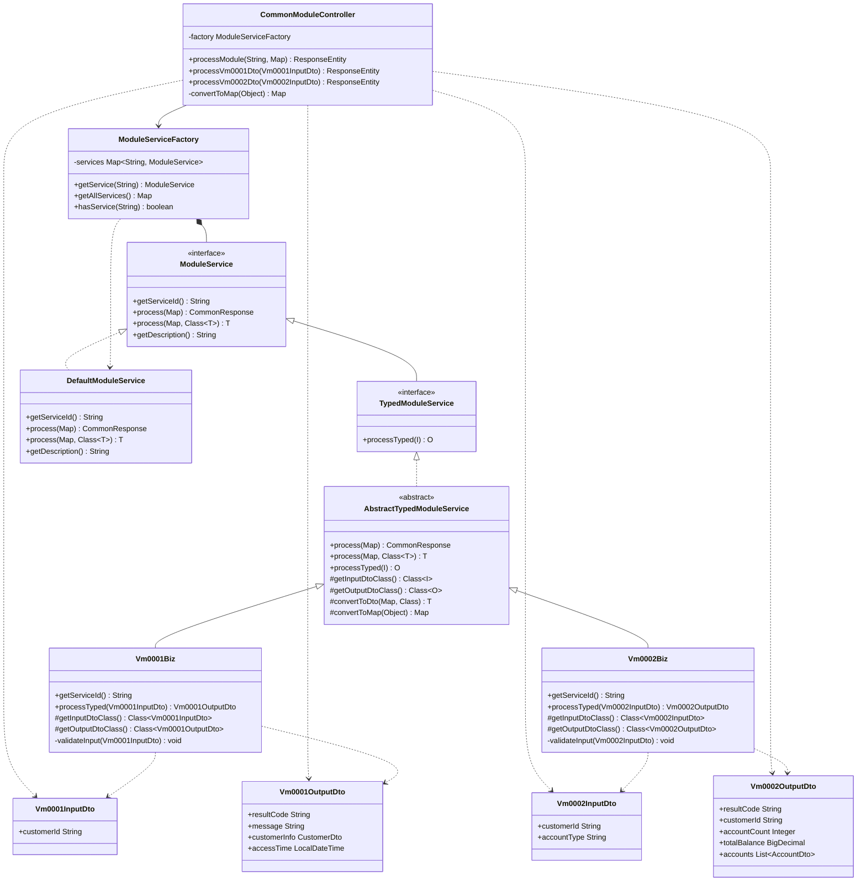
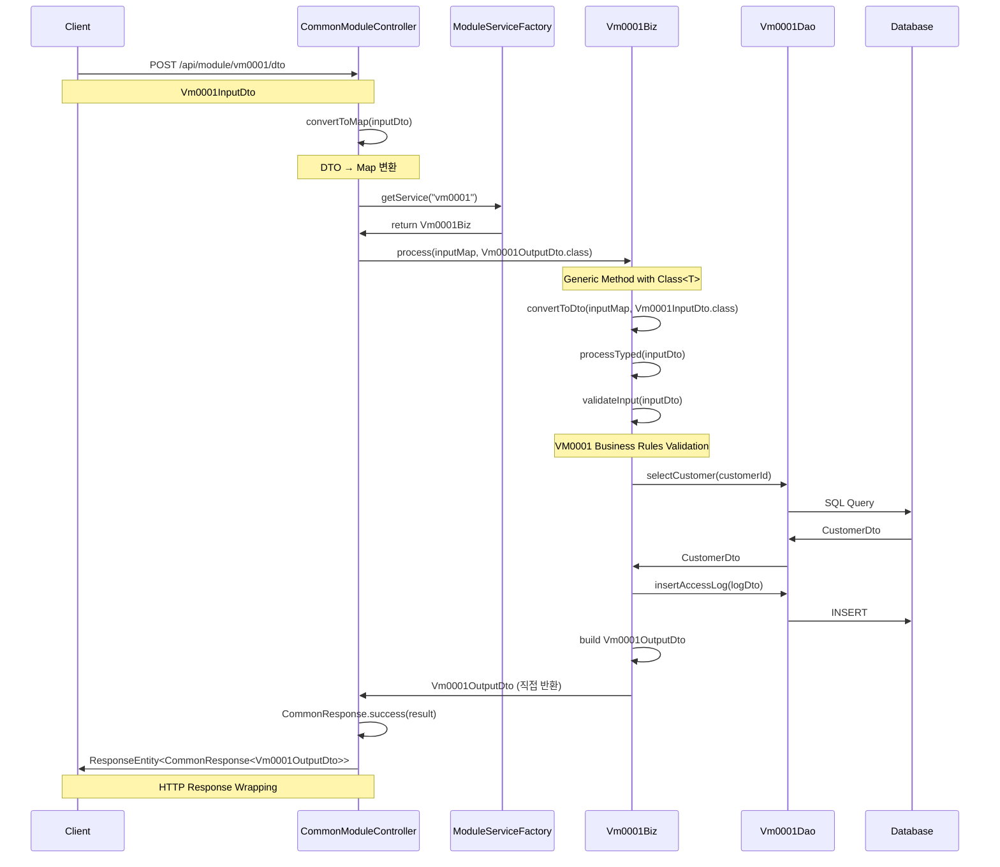
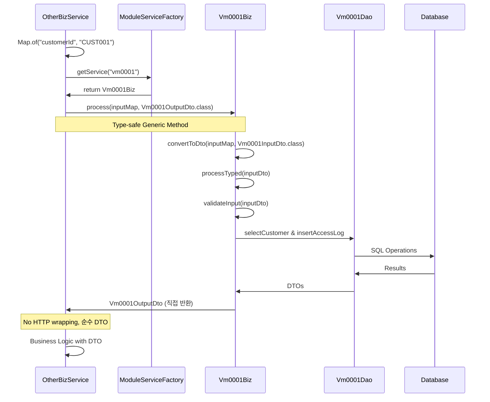

# 대규모 C → Java 변환 시스템 (Factory + DTO Pattern)

**🏭 Factory Pattern + Input/Output DTO로 1000개 이상 C 파일을 타입 안전하게 Java로 변환**  
독립 실행 가능한 Spring Boot 애플리케이션으로 제공됩니다.

## 📋 목차

- [🚀 핵심 아키텍처](#-핵심-아키텍처)
- [🏗️ 클래스 다이어그램](#️-클래스-다이어그램)
- [📋 Factory + DTO 패턴 구현 가이드](#-factory--dto-패턴-구현-가이드)
- [🔧 개발 절차](#-개발-절차)
- [🏗️ 프로젝트 구조](#️-프로젝트-구조)
- [🚀 시작하기](#-시작하기)
- [📚 API 사용법](#-api-사용법)
- [📊 샘플 코드](#-샘플-코드)
- [기존 유틸리티 모듈](#기존-유틸리티-모듈)
- [개발 가이드](#개발-가이드)

## 🚀 핵심 아키텍처

### Factory + Input/Output DTO 패턴의 장점
- **🏭 타입 안전성**: Input/Output DTO로 컴파일 타임 타입 검사
- **📝 모듈별 검증**: 각 모듈의 비즈니스 규칙에 따른 입력 데이터 검증
- **🔄 양방향 호환**: Map 기반과 DTO 기반 API 동시 지원
- **📊 명확한 인터페이스**: 각 모듈별 명시적인 입출력 스키마
- **🎯 단일 진입점**: 모든 모듈을 하나의 REST Controller로 처리
- **🚀 자동 서비스 등록**: Spring의 Component Scan으로 서비스 자동 발견
- **♻️ 공통 로직 통합**: 중복 코드를 Abstract 클래스로 추상화

### 변환 매핑 규칙
```
vm0001.c + vm0001.h  →  Vm0001Biz.java (비즈니스 로직)
vm0002.c + vm0002.h  →  Vm0002Biz.java (비즈니스 로직)
...
vm9999.c + vm9999.h  →  Vm9999Biz.java (비즈니스 로직)

+ 공통 인프라 파일들:
  - ModuleService.java (인터페이스)
  - AbstractModuleService.java (공통 로직)
  - ModuleServiceFactory.java (팩토리)
  - CommonModuleController.java (REST API)
  - 모듈별 MyBatis DAO 인터페이스들
  - 모듈별 DTO 클래스들
  - CommonResponse.java (응답 형식)
```

## 🏗️ 클래스 다이어그램

### Factory Pattern + DTO 아키텍처



### 요청 처리 플로우



### BIZ 레이어 직접 호출 플로우



## 📋 Factory + DTO 패턴 구현 가이드

### 1. MyBatis 아키텍처 구조

#### A. 모듈별 DAO 인터페이스 생성 (@Mapper 어노테이션 사용)
```java
@Mapper
public interface Vm0001Dao {
    
    @Select("SELECT customer_id as customerId, customer_name as customerName " +
            "FROM customer WHERE customer_id = #{customerId}")
    CustomerDto selectCustomer(@Param("customerId") String customerId);
    
    @Insert("INSERT INTO access_log (customer_id, access_type, access_time) " +
            "VALUES (#{customerId}, #{accessType}, #{accessTime})")
    int insertAccessLog(AccessLogDto accessLog);
    
    @Update("UPDATE customer SET last_access_time = #{lastAccessTime} " +
            "WHERE customer_id = #{customerId}")
    int updateLastAccess(@Param("customerId") String customerId, 
                        @Param("lastAccessTime") LocalDateTime lastAccessTime);
}
```

#### B. 모듈별 DTO 클래스 생성
```java
@Data
@Builder
@NoArgsConstructor
@AllArgsConstructor
public class CustomerDto {
    private String customerId;
    private String customerName;
    private String status;
    private String createTime;
    private LocalDateTime lastAccessTime;
}
```

#### C. 각 C 파일별 Biz 클래스 생성 (MyBatis DAO 주입)
```java
@Service
@RequiredArgsConstructor
public class Vm0001Biz extends AbstractModuleService {
    
    private final Vm0001Dao vm0001Dao;  // MyBatis DAO 주입
    
    @Override
    public String getServiceId() {
        return "vm0001";  // C 파일명과 매칭
    }
    
    @Override
    protected void validateInput(Map<String, Object> input) {
        // C 파일의 입력 검증 로직을 Java로 변환
        requireField(input, "customerId");
        requireLength(input, "customerId", 7);
    }
    
    @Override
    protected Object executeBusinessLogic(Map<String, Object> input) {
        String customerId = (String) input.get("customerId");
        
        // C의 함수들을 MyBatis DAO로 변환:
        // 1. select_customer() → vm0001Dao.selectCustomer()
        CustomerDto customer = vm0001Dao.selectCustomer(customerId);
        
        // 2. insert_access_log() → vm0001Dao.insertAccessLog()
        AccessLogDto accessLog = AccessLogDto.builder()
            .customerId(customerId)
            .accessType("INQUIRY")
            .accessTime(LocalDateTime.now())
            .build();
        vm0001Dao.insertAccessLog(accessLog);
        
        // 3. update_last_access() → vm0001Dao.updateLastAccess()
        vm0001Dao.updateLastAccess(customerId, LocalDateTime.now());
        
        return Map.of(
            "resultCode", "200",
            "customerInfo", customer,
            "message", "고객정보 조회 성공"
        );
    }
}
```

### 2. 데이터베이스 스키마 설정

#### A. H2 Database + MyBatis 설정 (application.yml)
```yaml
spring:
  # H2 Database (Demo)
  datasource:
    url: jdbc:h2:mem:testdb
    driverClassName: org.h2.Driver
    username: sa
    password: 
  
  h2:
    console:
      enabled: true
  
  sql:
    init:
      schema-locations: classpath:sql/schema.sql
      data-locations: classpath:sql/data.sql
      mode: always

# MyBatis Configuration
mybatis:
  mapper-locations: classpath:mapper/**/*.xml
  type-aliases-package: com.samsung.wm.modules.**.dto
  configuration:
    map-underscore-to-camel-case: true
    use-generated-keys: true
```

#### B. 데이터베이스 스키마 (schema.sql)
```sql
-- 고객 테이블 (customer_info_t)
CREATE TABLE IF NOT EXISTS customer (
    customer_id VARCHAR(20) PRIMARY KEY,
    customer_name VARCHAR(100) NOT NULL,
    status VARCHAR(20) NOT NULL DEFAULT 'ACTIVE',
    create_time VARCHAR(20) NOT NULL,
    last_access_time TIMESTAMP
);

-- 접근 로그 테이블 (access_log_t)
CREATE TABLE IF NOT EXISTS access_log (
    log_id BIGINT AUTO_INCREMENT PRIMARY KEY,
    customer_id VARCHAR(20) NOT NULL,
    access_type VARCHAR(20) NOT NULL,
    access_time TIMESTAMP NOT NULL,
    FOREIGN KEY (customer_id) REFERENCES customer(customer_id)
);
```

#### C. 테스트 데이터 (data.sql)
```sql
-- 고객 데이터
INSERT INTO customer (customer_id, customer_name, status, create_time) VALUES 
('CUST001', '홍길동', 'ACTIVE', '2025-01-01'),
('CUST002', '김철수', 'ACTIVE', '2025-01-02');
```

### 3. MyBatis + Factory 패턴 통합 구조

```
src/main/java/com/samsung/
├── common/                     # Factory 패턴 공통 인프라  
│   ├── factory/
│   │   └── ModuleServiceFactory.java    # 서비스 팩토리
│   ├── service/
│   │   ├── ModuleService.java           # 서비스 인터페이스
│   │   └── AbstractModuleService.java   # 공통 로직
│   └── response/
│       └── CommonResponse.java          # 통합 응답 형식
└── wm/                         # 모듈별 구현
    ├── controller/
    │   └── CommonModuleController.java  # 단일 REST 컨트롤러
    └── modules/                # C 파일별 모듈 (MyBatis 구조)
        ├── vm0001/
        │   ├── Vm0001Biz.java         # 비즈니스 로직  
        │   ├── dao/
        │   │   └── Vm0001Dao.java     # MyBatis @Mapper
        │   └── dto/
        │       ├── CustomerDto.java    # 고객 DTO
        │       └── AccessLogDto.java   # 접근로그 DTO
        ├── vm0002/
        │   ├── Vm0002Biz.java         # 비즈니스 로직
        │   ├── dao/ 
        │   │   └── Vm0002Dao.java     # MyBatis @Mapper
        │   └── dto/
        │       ├── AccountDto.java     # 계좌 DTO
        │       └── InquiryLogDto.java  # 조회로그 DTO
        └── ...                        # 1000개 모듈
```

### 4. 새로운 타입 안전한 DTO 기반 API

#### A. Input/Output DTO 정의
```java
// VM0001 Input DTO
@Data @Builder @NoArgsConstructor @AllArgsConstructor
public class Vm0001InputDto {
    private String customerId; // 10자리 영문대문자+숫자 (비즈니스 로직에서 검증)
}

// VM0001 Output DTO  
@Data @Builder @NoArgsConstructor @AllArgsConstructor
public class Vm0001OutputDto {
    private String resultCode;
    private String message;
    private CustomerDto customerInfo;
    private LocalDateTime accessTime;
}
```

#### B. TypedModuleService 구현
```java
@Service
@RequiredArgsConstructor
public class Vm0001Biz extends AbstractTypedModuleService<Vm0001InputDto, Vm0001OutputDto> {
    
    private final Vm0001Dao vm0001Dao;
    
    @Override
    public String getServiceId() { return "vm0001"; }
    
    @Override
    public Class<Vm0001InputDto> getInputDtoClass() { return Vm0001InputDto.class; }
    
    @Override
    public Class<Vm0001OutputDto> getOutputDtoClass() { return Vm0001OutputDto.class; }
    
    @Override
    public Vm0001OutputDto processTyped(Vm0001InputDto inputDto) {
        // 타입 안전한 비즈니스 로직 구현 (직접 DTO 반환)
        CustomerDto customer = vm0001Dao.selectCustomer(inputDto.getCustomerId());
        
        return Vm0001OutputDto.builder()
            .resultCode("200")
            .message("고객정보 조회 성공")
            .customerInfo(customer)
            .accessTime(LocalDateTime.now())
            .build();
    }
}
```

#### C. Generic Process Method 활용
```java
// BIZ 레이어에서 직접 호출 (권장 방법)
@Service
@RequiredArgsConstructor
public class IntegratedBiz {
    private final ModuleServiceFactory factory;
    
    public CustomerAnalysis analyzeCustomer(String customerId) {
        // 고객정보 조회 - Generic Method 사용
        Map<String, Object> vm0001Input = Map.of("customerId", customerId);
        Vm0001OutputDto customerInfo = factory.getService("vm0001")
            .process(vm0001Input, Vm0001OutputDto.class);
            
        // 계좌정보 조회 - Generic Method 사용
        Map<String, Object> vm0002Input = Map.of("customerId", customerId);
        Vm0002OutputDto accountInfo = factory.getService("vm0002")
            .process(vm0002Input, Vm0002OutputDto.class);
        
        // 직접 DTO로 비즈니스 로직 처리
        return CustomerAnalysis.builder()
            .customer(customerInfo.getCustomerInfo())
            .totalBalance(accountInfo.getTotalBalance())
            .riskLevel(calculateRiskLevel(accountInfo))
            .build();
    }
}
```

### 5. REST API 사용법

#### A. 기존 Map 기반 API (하위 호환)
```bash
# 모든 등록된 서비스 조회
GET /api/module/services

# vm0001 고객정보 조회 서비스 실행 (Map 기반)
POST /api/module/vm0001
{
  "customerId": "CUST001"
}
```

#### B. 새로운 DTO 기반 API (권장)
```bash
# VM0001 고객정보 조회 (타입 안전한 DTO)
POST /api/module/vm0001/dto
{
  "customerId": "CUST001"
}

# 응답 예시 (타입 안전)
{
  "success": true,
  "code": "0000", 
  "message": "고객정보 조회 성공",
  "data": {
    "resultCode": "200",
    "message": "고객정보 조회 성공",
    "customerInfo": {
      "customerId": "CUST001",
      "customerName": "홍길동",
      "status": "ACTIVE",
      "createTime": "2025-01-01"
    },
    "accessTime": "2025-09-02T10:30:45"
  }
}

# VM0002 계좌잔고 조회 (타입 안전한 DTO)  
POST /api/module/vm0002/dto
{
  "customerId": "CUST001",
  "accountType": "SAVINGS"
}

# 응답 예시 (타입 안전)
{
  "success": true,
  "code": "0000",
  "message": "계좌잔고 조회 성공", 
  "data": {
    "resultCode": "200",
    "message": "계좌잔고 조회 성공",
    "customerId": "CUST001",
    "accountCount": 2,
    "totalBalance": 1500000.00,
    "accounts": [
      {
        "accountNo": "1001-001-001",
        "accountType": "SAVINGS", 
        "balance": 1000000.00,
        "interestRate": 2.5,
        "lastTransactionTime": "2025-09-01T10:30:45"
      }
    ],
    "inquiryTime": "2025-09-02T10:30:45"
  }
}
```

## 📊 샘플 코드

### VM0003 새 모듈 추가 예시

#### 1. Input/Output DTO 정의
```java
// VM0003 입금 처리 Input DTO
@Data @Builder @NoArgsConstructor @AllArgsConstructor
public class Vm0003InputDto {
    private String accountNo;     // 계좌번호 (비즈니스 로직에서 검증)
    private BigDecimal amount;    // 입금액 (비즈니스 로직에서 검증)
    private String memo;          // 입금 메모 (비즈니스 로직에서 검증)
}

// VM0003 입금 처리 Output DTO
@Data @Builder @NoArgsConstructor @AllArgsConstructor
public class Vm0003OutputDto {
    private String resultCode;
    private String message;
    private String accountNo;
    private BigDecimal beforeBalance;
    private BigDecimal afterBalance;
    private String transactionId;
    private LocalDateTime processTime;
}
```

#### 2. 비즈니스 로직 구현
```java
@Service
@RequiredArgsConstructor
public class Vm0003Biz extends AbstractTypedModuleService<Vm0003InputDto, Vm0003OutputDto> {
    
    private final Vm0003Dao vm0003Dao;
    
    @Override
    public String getServiceId() { return "vm0003"; }
    
    @Override
    public Class<Vm0003InputDto> getInputDtoClass() { return Vm0003InputDto.class; }
    
    @Override
    public Class<Vm0003OutputDto> getOutputDtoClass() { return Vm0003OutputDto.class; }
    
    @Override
    public CommonResponse<Vm0003OutputDto> processTyped(Vm0003InputDto inputDto) {
        // 타입 안전한 비즈니스 로직 구현
        AccountDto account = vm0003Dao.selectAccount(inputDto.getAccountNo());
        
        // 잔고 업데이트 및 거래 로그 기록
        BigDecimal beforeBalance = account.getBalance();
        vm0003Dao.updateBalance(inputDto.getAccountNo(), inputDto.getAmount());
        
        Vm0003OutputDto result = Vm0003OutputDto.builder()
            .resultCode("200")
            .message("입금 처리 성공")
            .accountNo(inputDto.getAccountNo())
            .beforeBalance(beforeBalance)
            .afterBalance(beforeBalance.add(inputDto.getAmount()))
            .processTime(LocalDateTime.now())
            .build();
            
        return CommonResponse.success(result, "입금 처리 성공");
    }
}
```

#### 3. API 호출 예시
```bash
# VM0003 입금 처리 (타입 안전한 DTO)
POST /api/module/vm0003/dto
{
  "accountNo": "100100100001",
  "amount": 50000,
  "memo": "급여 입금"
}

# 응답 예시
{
  "success": true,
  "code": "0000",
  "message": "입금 처리 성공",
  "data": {
    "resultCode": "200",
    "message": "입금 처리 성공",
    "accountNo": "100100100001",
    "beforeBalance": 1000000.00,
    "afterBalance": 1050000.00,
    "transactionId": "TXN20250902001",
    "processTime": "2025-09-02T10:35:22"
  }
}
```

### Generic Process Method 활용 예시

#### 🔄 다양한 호출 방법
```java
// 1. BIZ 레이어 직접 호출 (권장)
ModuleService service = factory.getService("vm0003");
Map<String, Object> input = Map.of("accountNo", "100100100001", "amount", 50000);
Vm0003OutputDto result = service.process(input, Vm0003OutputDto.class);

// 2. HTTP API 호출 
POST /api/module/vm0003/dto
{ "accountNo": "100100100001", "amount": 50000, "memo": "급여 입금" }

// 3. 기존 Map 기반 API (하위 호환)
POST /api/module/vm0003
{ "accountNo": "100100100001", "amount": 50000 }
```

#### 🎯 타입 안전성과 성능 최적화
```java
// Generic Method: 한 번의 호출로 타입 안전한 결과
Vm0001OutputDto customerData = moduleService.process(inputMap, Vm0001OutputDto.class);

// 컴파일 타임 타입 체크 + 런타임 성능 최적화
if ("200".equals(customerData.getResultCode())) {
    CustomerDto customer = customerData.getCustomerInfo(); // 타입 안전
    // 비즈니스 로직...
}

// 모듈별 비즈니스 검증 로직 적용
private BigDecimal amount; // validateInput()에서 검증 처리
```

#### 🚀 확장성과 생산성
```java
// 새 모듈 추가 시 필요한 코드 (최소화)
1. InputDto + OutputDto 정의 (2개 클래스)
2. Dao 인터페이스 정의 (1개 인터페이스)  
3. Biz 클래스 구현 (1개 클래스) 
4. Generic Process Method 자동 상속 (추가 코드 불필요!)

// BIZ 간 호출도 자동으로 타입 안전
SomeOutputDto result = factory.getService("someModule")
    .process(inputMap, SomeOutputDto.class); // 자동 타입 변환
```

## 🔧 개발 절차

### Factory + DTO 패턴 기반 변환 프로세스
1. **C 파일 분석**: 함수 목록, 구조체 정의, SQL 패턴 파악
2. **ServiceId 결정**: C 파일명을 기반으로 고유 ID 생성 (vm0001)
3. **DTO 클래스 생성**: C 구조체를 Java DTO로 변환 (@Data, @Builder 사용)
4. **MyBatis DAO 생성**: @Mapper 인터페이스로 데이터 접근 레이어 구현
5. **비즈니스 로직 변환**: executeBusinessLogic()에서 MyBatis DAO 메소드 호출
6. **데이터베이스 스키마**: C 구조체를 기반으로 테이블 스키마 생성  
7. **테스트**: REST API로 MyBatis 연동 및 기능 검증

### 변환 우선순위
1. **핵심 업무 모듈** (고객 조회, 계좌 관리 등)
2. **공통 유틸리티 모듈** (검증, 계산, 변환)
3. **배치 처리 모듈** (정산, 집계 등)
4. **리포트 모듈** (조회, 통계)

## 🏗️ 프로젝트 구조

```
src/main/java/com/samsung/
├── common/                    # Factory 패턴 공통 인프라 + 유틸리티
│   ├── calc/                  # 계산 유틸리티 (C → Java 변환)
│   │   ├── FinancialCalculator.java
│   │   └── StatisticsCalculator.java
│   ├── constants/
│   │   └── ErrorCodes.java
│   ├── converter/
│   │   └── DataConverter.java
│   ├── factory/
│   │   └── ModuleServiceFactory.java  # 서비스 팩토리
│   ├── response/
│   │   └── CommonResponse.java        # 통합 응답 형식
│   ├── service/
│   │   ├── ModuleService.java         # 서비스 인터페이스
│   │   └── AbstractModuleService.java # 공통 로직
│   └── util/                  # 유틸리티 클래스
│       ├── StringUtil.java
│       ├── DateUtil.java
│       └── ValidationUtil.java
└── wm/                        # MyBatis + Factory 패턴 모듈
    ├── WmCommonApplication.java       # Spring Boot 메인 (@MapperScan 설정)
    ├── controller/
    │   └── CommonModuleController.java # 단일 REST 컨트롤러
    └── modules/               # C 파일별 모듈 (MyBatis 구조)
        ├── vm0001/            # 고객정보 조회 모듈
        │   ├── Vm0001Biz.java         # 비즈니스 로직
        │   ├── dao/
        │   │   └── Vm0001Dao.java     # @Mapper 인터페이스
        │   └── dto/
        │       ├── CustomerDto.java    # 고객 DTO
        │       └── AccessLogDto.java   # 접근로그 DTO  
        ├── vm0002/            # 계좌잔고 조회 모듈
        │   ├── Vm0002Biz.java         # 비즈니스 로직
        │   ├── dao/
        │   │   └── Vm0002Dao.java     # @Mapper 인터페이스
        │   └── dto/
        │       ├── AccountDto.java     # 계좌 DTO
        │       └── InquiryLogDto.java  # 조회로그 DTO
        └── ...                # 1000개 모듈 (동일한 구조)

## 🚀 시작하기

### 사전 요구사항
- **Java 17+**: OpenJDK 17 이상
- **Gradle 7.0+**: 빌드 도구
- **Git**: 소스 코드 관리

### 설치 및 실행

#### 1. 소스 코드 클론
```bash
git clone https://github.com/kubelin/wm-common.git
cd wm-common
```

#### 2. 프로젝트 빌드
```bash
# Gradle을 사용한 빌드
gradle clean build

# 또는 Gradle Wrapper 사용 (있는 경우)
./gradlew clean build
```

#### 3. 애플리케이션 실행
```bash
# 기본 포트 8080으로 실행 (기본 설정)
java -jar build/libs/wm-common-standalone-1.0.0.jar

# 다른 포트로 실행 (예: 8081)
java -jar build/libs/wm-common-standalone-1.0.0.jar --server.port=8081
```

#### 4. 애플리케이션 확인
```bash
# Health Check
curl http://localhost:8080/wm-common/api/wm-common/health

# 응답 예시
# {"status":"UP","application":"WM Common Standalone","version":"1.0.0"}
```

### 개발 모드 실행
```bash
# Gradle을 통한 개발 실행
gradle bootRun

# 다른 포트로 개발 실행
gradle bootRun --args='--server.port=8081'
```

## 📚 API 사용법

애플리케이션은 다음 베이스 URL에서 RESTful API를 제공합니다:
- **베이스 URL**: `http://localhost:8080/wm-common`
- **API 경로**: `http://localhost:8080/wm-common/api/wm-common/*`

### 1. Health Check API
```bash
GET /api/wm-common/health

# 응답
{
  "status": "UP",
  "application": "WM Common Standalone",
  "version": "1.0.0",
  "timestamp": "2025-08-31 16:41:45"
}
```

### 2. 공통 유틸리티 테스트 API
```bash
GET /api/wm-common/utils/test

# 응답 예시
{
  "string_utils": {
    "masked": "123****890",
    "is_valid_email": true,
    "is_not_empty": true,
    "original": "   test@example.com   "
  },
  "date_utils": {
    "today": "2025-08-31",
    "age_if_born_1990": 35,
    "days_until_year_end": 122
  },
  "financial_calc": {
    "principal": "1,000,000원",
    "years": "5년",
    "rate": "5%",
    "compound_result": "1,276,282원"
  },
  "error_codes": {
    "success": "0000",
    "null_parameter": "0003",
    "business_error": "2001"
  }
}
```

### 3. 상담 서비스 API
```bash
POST /api/wm-common/consultation?customerId=CUST001&consultationType=INITIAL

# 응답 예시
{
  "success": true,
  "consultation_result": {
    "customerId": "CUST001",
    "type": "INITIAL",
    "summary": "초기 상담이 성공적으로 완료되었습니다.",
    "details": {
      "riskProfile": "conservative",
      "investmentGoal": "장기투자",
      "initialAmount": 10000000
    },
    "consultedAt": "2025-08-31T16:41:41.152756",
    "success": true
  },
  "timestamp": "2025-08-31 16:41:41"
}
```

### 4. 투자 계획 서비스 API
```bash
POST /api/wm-common/investment-plan?customerId=CUST001&amount=5000000&riskProfile=conservative&period=medium&goal=balanced

# 응답 예시
{
  "success": true,
  "investment_plan": {
    "customerId": "CUST001",
    "type": "CONSERVATIVE",
    "planName": "안정형 자산배분 포트폴리오",
    "description": "안정성을 중시하는 보수적 투자 전략으로 채권 비중을 높게 구성",
    "totalAmount": 5000000,
    "allocations": [
      {
        "assetType": "BOND",
        "symbol": "KTB_10Y",
        "amount": 2500000.0,
        "weight": 50.0
      },
      {
        "assetType": "BOND", 
        "symbol": "CORP_BOND",
        "amount": 1000000.0,
        "weight": 20.0
      },
      {
        "assetType": "STOCK",
        "symbol": "KODEX200",
        "amount": 1000000.0,
        "weight": 20.0
      },
      {
        "assetType": "CASH",
        "symbol": "MMF",
        "amount": 500000.0,
        "weight": 10.0
      }
    ],
    "expectedReturn": "연 3-5%",
    "riskLevel": "낮음"
  }
}
```

## 🔧 핵심 모듈

### 공통 유틸리티 (C → Java 변환)

#### StringUtil - 문자열 처리
```java
// C의 string.h 함수들과 유사한 기능
StringUtil.isEmpty(str)           // 빈 문자열 체크
StringUtil.mask(str, '*', 3, 7)   // 문자열 마스킹 (****로 숨기기)
StringUtil.isValidEmail(email)    // 이메일 형식 검증
StringUtil.extractNumbers(str)    // 문자열에서 숫자 추출
```

#### DateUtil - 날짜 처리  
```java
// C의 time.h 함수들과 유사한 기능
DateUtil.formatDate(LocalDate.now())        // 날짜 포맷팅
DateUtil.daysBetween(start, end)            // 두 날짜 사이의 일 수
DateUtil.calculateAge(birthDate)            // 나이 계산
DateUtil.isWorkingDay(date)                 // 평일 여부 확인
```

#### FinancialCalculator - 금융 계산
```java
// 복리 계산: 원금, 이율, 복리 주기, 기간
BigDecimal result = FinancialCalculator.compoundInterest(
    new BigDecimal("1000000"),  // 100만원
    new BigDecimal("0.05"),     // 연 5%
    1,                          // 연복리
    new BigDecimal("5")         // 5년
);
// 결과: 1,276,282원

// 대출 상환액 계산
BigDecimal payment = FinancialCalculator.loanPayment(
    new BigDecimal("50000000"), // 대출 원금 5천만원
    new BigDecimal("0.04"),     // 연 4%
    240                         // 20년 (240개월)
);
```

#### DataConverter - 안전한 데이터 변환
```java
// C의 atoi(), atof() 등을 안전하게 변환
Integer number = DataConverter.toInteger("123");        // 문자열 → 정수
BigDecimal decimal = DataConverter.toBigDecimal("123.45"); // 문자열 → BigDecimal
String currency = DataConverter.toCurrencyString(1234567); // "1,234,567"

// null이나 잘못된 형식에 대한 안전한 처리
int safe = DataConverter.toInteger("invalid", 0);       // 0 반환 (기본값)
```

### 전략 패턴 서비스

#### 단순화된 전략 패턴 (Factory 패턴 제거)
```java
@Service
@RequiredArgsConstructor
public class ConsultationService {
    // Factory 대신 직접 주입
    private final InitialConsultationStrategy initialStrategy;
    // private final PeriodicConsultationStrategy periodicStrategy; // 향후 추가
    
    // 간단한 switch 문으로 전략 선택
    private ConsultationStrategy selectStrategy(String type) {
        return switch (type.toUpperCase()) {
            case "INITIAL" -> initialStrategy;
            // case "PERIODIC" -> periodicStrategy; // 향후 추가
            default -> initialStrategy; // 기본 전략
        };
    }
}
```

## 🏗️ 서비스 아키텍처

### 아키텍처 원칙
1. **단순성 우선**: 복잡한 패턴보다 단순하고 명확한 구조
2. **직접 주입**: Factory 패턴 대신 Spring의 직접 의존성 주입 활용  
3. **전략 패턴**: 알고리즘을 인터페이스로 분리하여 확장성 확보
4. **공통 모듈**: C 함수들을 Java 정적 유틸리티로 변환

### 확장 가이드

#### 새로운 전략 추가하기
1. **전략 인터페이스 구현**
```java
@Component
public class AggressiveInvestmentStrategy implements InvestmentStrategy {
    @Override
    public InvestmentPlan execute(InvestmentRequest request) {
        // 적극적 투자 전략 구현
        return createAggressivePlan(request);
    }
}
```

2. **서비스에 주입 및 선택 로직 추가**
```java
@Service 
@RequiredArgsConstructor
public class InvestmentPlanningService {
    private final ConservativeInvestmentStrategy conservativeStrategy;
    private final AggressiveInvestmentStrategy aggressiveStrategy; // 추가
    
    private InvestmentStrategy selectStrategy(String type) {
        return switch (type.toUpperCase()) {
            case "CONSERVATIVE" -> conservativeStrategy;
            case "AGGRESSIVE" -> aggressiveStrategy; // 추가
            default -> conservativeStrategy;
        };
    }
}
```

## 💻 개발 가이드

### C → Java 변환 가이드

#### 1. C 함수 → Java 정적 메소드
```c
// C 함수
int is_empty(const char* str) {
    return str == NULL || strlen(str) == 0;
}
```

```java
// Java 정적 메소드
public static boolean isEmpty(String str) {
    return str == null || str.trim().isEmpty();
}
```

#### 2. C 구조체 → Java 클래스
```c
// C 구조체
typedef struct {
    char customer_id[50];
    double amount;
    int period;
} investment_request_t;
```

```java
// Java 클래스 (Lombok 사용)
@Data
@AllArgsConstructor
public class InvestmentRequest {
    private String customerId;
    private BigDecimal investmentAmount;
    private String investmentPeriod;
}
```

#### 3. C 함수 포인터 → Java 전략 패턴
```c
// C 함수 포인터
typedef investment_plan_t* (*investment_strategy_func)(investment_request_t*);

investment_strategy_func strategies[] = {
    conservative_strategy,
    aggressive_strategy
};
```

```java
// Java 전략 패턴
public interface InvestmentStrategy {
    InvestmentPlan execute(InvestmentRequest request);
}

@Component
public class ConservativeInvestmentStrategy implements InvestmentStrategy {
    // 구현...
}
```

### 테스트 가이드

#### 단위 테스트 작성
```java
@Test
void testStringUtilMasking() {
    // given
    String original = "1234567890";
    
    // when
    String masked = StringUtil.mask(original, '*', 3, 7);
    
    // then
    assertThat(masked).isEqualTo("123****890");
}
```

#### 통합 테스트 작성
```java
@SpringBootTest
@TestPropertySource(properties = "server.port=0")
class WmCommonIntegrationTest {
    
    @Autowired
    private TestRestTemplate restTemplate;
    
    @Test
    void testHealthEndpoint() {
        ResponseEntity<Map> response = restTemplate.getForEntity(
            "/api/wm-common/health", 
            Map.class
        );
        
        assertThat(response.getStatusCode()).isEqualTo(HttpStatus.OK);
        assertThat(response.getBody().get("status")).isEqualTo("UP");
    }
}
```

### 배포 가이드

#### Docker 배포
```dockerfile
# Dockerfile
FROM openjdk:17-jre-slim

COPY build/libs/wm-common-standalone-1.0.0.jar app.jar

EXPOSE 8080

ENTRYPOINT ["java", "-jar", "/app.jar"]
```

```bash
# Docker 이미지 빌드 및 실행
docker build -t wm-common .
docker run -p 8080:8080 wm-common
```

### 기여 가이드

1. **Fork** 저장소를 개인 계정으로 Fork
2. **Feature Branch** 생성: `git checkout -b feature/새기능명`
3. **개발** 및 **테스트** 수행
4. **커밋**: `git commit -m "feat: 새로운 기능 추가"`
5. **Push**: `git push origin feature/새기능명`
6. **Pull Request** 생성

## 통합된 아키텍처

이 프로젝트는 Factory 패턴과 기존 C → Java 변환 유틸리티를 통합한 구조입니다:

### MyBatis + Factory 패턴 통합 모듈 
- **ModuleService**: 모든 C 파일 변환을 위한 공통 인터페이스
- **AbstractModuleService**: 공통 검증, 트랜잭션, 에러 처리 로직
- **ModuleServiceFactory**: ServiceId 기반 자동 서비스 발견 및 라우팅
- **모듈별 @Mapper DAO**: MyBatis 인터페이스로 타입 안전한 데이터 접근
- **모듈별 DTO 클래스**: C 구조체를 Java 객체로 변환
- **CommonModuleController**: 단일 REST 엔드포인트 (`/api/module/{serviceId}`)
- **H2 Database**: 인메모리 데이터베이스 + 자동 스키마/데이터 초기화

### 기존 유틸리티 모듈 (통합)
- **StringUtil**: C의 `string.h` 함수들을 Java로 변환
- **DateUtil**: C의 `time.h` 함수들을 Java LocalDate/LocalDateTime으로 변환  
- **FinancialCalculator**: 금융 계산 함수들 (복리, 대출상환 등)
- **DataConverter**: C의 `atoi()`, `atof()` 등을 안전한 Java 변환 함수로

### 라이선스
이 프로젝트는 MIT 라이선스 하에 배포됩니다.

---

**개발자**: Samsung WM Platform Team  
**최종 업데이트**: 2025-09-02  
**버전**: 4.0.0 (Factory Pattern + Input/Output DTO - Type-Safe Architecture)
