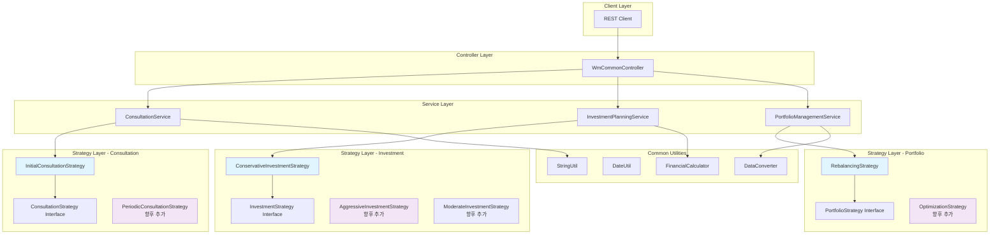
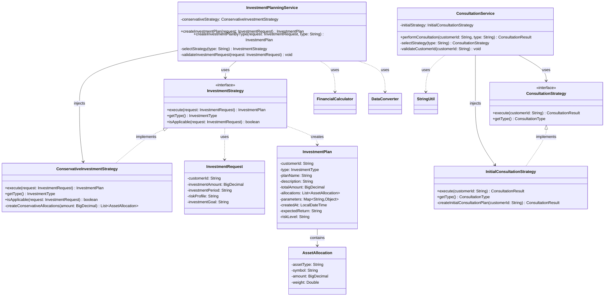

# WM-Common - Wealth Management Common Module

**독립 실행 가능한 Spring Boot 애플리케이션**  
C 공통 함수들을 Java로 변환한 유틸리티 모듈과 전략 패턴 기반 재무 관리 서비스를 제공합니다.

## 📋 목차

- [프로젝트 개요](#프로젝트-개요)
- [주요 특징](#주요-특징)
- [프로젝트 구조](#프로젝트-구조)
- [시작하기](#시작하기)
- [API 사용법](#api-사용법)
- [핵심 모듈](#핵심-모듈)
- [서비스 아키텍처](#서비스-아키텍처)
- [개발 가이드](#개발-가이드)

## 🎯 프로젝트 개요

WM-Common은 C 언어의 공통 함수들을 Java로 마이그레이션하면서 현대적인 Spring Boot 패턴을 적용한 재무 관리(Wealth Management) 도메인 공통 모듈입니다.

### 설계 철학
- **C → Java 변환**: 절차지향 → 객체지향 패턴 적용
- **단순화된 전략 패턴**: Factory 없는 직접 주입 방식
- **공통 유틸리티**: 정적 메소드 기반 유틸리티 클래스
- **실용적 접근**: 복잡성보다 실용성과 유지보수성 우선

## ✨ 주요 특징

### 📦 C → Java 마이그레이션 패턴
- **StringUtil**: C의 `string.h` 함수들을 Java로 변환
- **DateUtil**: C의 `time.h` 함수들을 Java LocalDate/LocalDateTime으로 변환  
- **FinancialCalculator**: 금융 계산 함수들 (복리, 대출상환 등)
- **DataConverter**: C의 `atoi()`, `atof()` 등을 안전한 Java 변환 함수로

### 🎯 전략 패턴 서비스
- **상담 서비스**: 고객 상담 유형별 전략 (초기, 정기, 긴급 등)
- **투자 계획**: 위험성향별 투자 전략 (보수적, 적극적 등)  
- **포트폴리오 관리**: 리밸런싱, 최적화, 위험관리 전략

### 🚀 독립 실행
- Spring Boot 3.2.1 기반 독립 실행 가능
- RESTful API 제공으로 테스트 및 통합 용이
- Docker 컨테이너화 지원

## 📁 프로젝트 구조

```
wm-common-standalone/
├── README.md
├── build.gradle                    # Spring Boot 애플리케이션 설정
├── .gitignore                     # Git 제외 파일 설정
│
├── src/main/java/com/samsung/
│   ├── common/                    # 공통 유틸리티 (C → Java 변환)
│   │   ├── calc/                  # 계산 유틸리티
│   │   │   ├── FinancialCalculator.java    # 금융 계산 (복리, 대출 등)
│   │   │   └── StatisticsCalculator.java   # 통계 계산 (평균, 표준편차 등)
│   │   ├── constants/             # 상수 정의
│   │   │   └── ErrorCodes.java              # 에러 코드 (C의 #define과 유사)
│   │   ├── converter/             # 데이터 변환
│   │   │   └── DataConverter.java           # 안전한 데이터 변환 (atoi, atof 등)
│   │   ├── exception/             # 예외 처리
│   │   │   └── BusinessException.java      # 비즈니스 예외
│   │   └── util/                  # 유틸리티 클래스
│   │       ├── StringUtil.java              # 문자열 처리 (string.h 유사)
│   │       ├── DateUtil.java                # 날짜 처리 (time.h 유사)  
│   │       └── ValidationUtil.java          # 검증 유틸리티
│   │
│   └── wm/                        # 재무 관리 도메인
│       ├── WmCommonApplication.java         # Spring Boot 메인 클래스
│       ├── controller/            # REST API
│       │   └── WmCommonController.java      # 테스트용 API 컨트롤러
│       ├── service/               # 비즈니스 서비스 
│       │   ├── ConsultationService.java     # 상담 서비스
│       │   ├── InvestmentPlanningService.java # 투자 계획 서비스
│       │   └── PortfolioManagementService.java # 포트폴리오 관리 서비스
│       ├── strategy/              # 전략 패턴 구현
│       │   ├── consultation/      # 상담 전략
│       │   │   ├── ConsultationStrategy.java      # 상담 전략 인터페이스
│       │   │   ├── ConsultationResult.java        # 상담 결과
│       │   │   └── impl/
│       │   │       └── InitialConsultationStrategy.java # 초기 상담 전략
│       │   ├── investment/        # 투자 전략
│       │   │   ├── InvestmentStrategy.java         # 투자 전략 인터페이스
│       │   │   ├── InvestmentRequest.java          # 투자 요청
│       │   │   ├── InvestmentPlan.java             # 투자 계획
│       │   │   └── impl/
│       │   │       └── ConservativeInvestmentStrategy.java # 보수적 투자 전략
│       │   └── portfolio/         # 포트폴리오 전략
│       │       ├── PortfolioStrategy.java          # 포트폴리오 전략 인터페이스
│       │       ├── PortfolioRequest.java           # 포트폴리오 요청
│       │       └── impl/
│       │           └── RebalancingStrategy.java    # 리밸런싱 전략
│       ├── dto/                   # 데이터 전송 객체
│       ├── integration/           # 외부 연동
│       └── constants/             # 도메인 상수
│
└── src/main/resources/
    └── application.yml            # 애플리케이션 설정
```

## 🚀 시작하기

### 사전 요구사항
- **Java 17+**: OpenJDK 17 이상
- **Gradle 7.0+**: 빌드 도구
- **Git**: 소스 코드 관리

### 설치 및 실행

#### 1. 소스 코드 클론
```bash
git clone https://github.com/kubelin/wm-common.git
cd wm-common
```

#### 2. 프로젝트 빌드
```bash
# Gradle을 사용한 빌드
gradle clean build

# 또는 Gradle Wrapper 사용 (있는 경우)
./gradlew clean build
```

#### 3. 애플리케이션 실행
```bash
# 기본 포트 8080으로 실행 (기본 설정)
java -jar build/libs/wm-common-standalone-1.0.0.jar

# 다른 포트로 실행 (예: 8081)
java -jar build/libs/wm-common-standalone-1.0.0.jar --server.port=8081
```

#### 4. 애플리케이션 확인
```bash
# Health Check
curl http://localhost:8080/wm-common/api/wm-common/health

# 응답 예시
# {"status":"UP","application":"WM Common Standalone","version":"1.0.0"}
```

### 개발 모드 실행
```bash
# Gradle을 통한 개발 실행
gradle bootRun

# 다른 포트로 개발 실행
gradle bootRun --args='--server.port=8081'
```

## 📚 API 사용법

애플리케이션은 다음 베이스 URL에서 RESTful API를 제공합니다:
- **베이스 URL**: `http://localhost:8080/wm-common`
- **API 경로**: `http://localhost:8080/wm-common/api/wm-common/*`

### 1. Health Check API
```bash
GET /api/wm-common/health

# 응답
{
  "status": "UP",
  "application": "WM Common Standalone",
  "version": "1.0.0",
  "timestamp": "2025-08-31 16:41:45"
}
```

### 2. 공통 유틸리티 테스트 API
```bash
GET /api/wm-common/utils/test

# 응답 예시
{
  "string_utils": {
    "masked": "123****890",
    "is_valid_email": true,
    "is_not_empty": true,
    "original": "   test@example.com   "
  },
  "date_utils": {
    "today": "2025-08-31",
    "age_if_born_1990": 35,
    "days_until_year_end": 122
  },
  "financial_calc": {
    "principal": "1,000,000원",
    "years": "5년",
    "rate": "5%",
    "compound_result": "1,276,282원"
  },
  "error_codes": {
    "success": "0000",
    "null_parameter": "0003",
    "business_error": "2001"
  }
}
```

### 3. 상담 서비스 API
```bash
POST /api/wm-common/consultation?customerId=CUST001&consultationType=INITIAL

# 응답 예시
{
  "success": true,
  "consultation_result": {
    "customerId": "CUST001",
    "type": "INITIAL",
    "summary": "초기 상담이 성공적으로 완료되었습니다.",
    "details": {
      "riskProfile": "conservative",
      "investmentGoal": "장기투자",
      "initialAmount": 10000000
    },
    "consultedAt": "2025-08-31T16:41:41.152756",
    "success": true
  },
  "timestamp": "2025-08-31 16:41:41"
}
```

### 4. 투자 계획 서비스 API
```bash
POST /api/wm-common/investment-plan?customerId=CUST001&amount=5000000&riskProfile=conservative&period=medium&goal=balanced

# 응답 예시
{
  "success": true,
  "investment_plan": {
    "customerId": "CUST001",
    "type": "CONSERVATIVE",
    "planName": "안정형 자산배분 포트폴리오",
    "description": "안정성을 중시하는 보수적 투자 전략으로 채권 비중을 높게 구성",
    "totalAmount": 5000000,
    "allocations": [
      {
        "assetType": "BOND",
        "symbol": "KTB_10Y",
        "amount": 2500000.0,
        "weight": 50.0
      },
      {
        "assetType": "BOND", 
        "symbol": "CORP_BOND",
        "amount": 1000000.0,
        "weight": 20.0
      },
      {
        "assetType": "STOCK",
        "symbol": "KODEX200",
        "amount": 1000000.0,
        "weight": 20.0
      },
      {
        "assetType": "CASH",
        "symbol": "MMF",
        "amount": 500000.0,
        "weight": 10.0
      }
    ],
    "expectedReturn": "연 3-5%",
    "riskLevel": "낮음"
  }
}
```

## 🔧 핵심 모듈

### 공통 유틸리티 (C → Java 변환)

#### StringUtil - 문자열 처리
```java
// C의 string.h 함수들과 유사한 기능
StringUtil.isEmpty(str)           // 빈 문자열 체크
StringUtil.mask(str, '*', 3, 7)   // 문자열 마스킹 (****로 숨기기)
StringUtil.isValidEmail(email)    // 이메일 형식 검증
StringUtil.extractNumbers(str)    // 문자열에서 숫자 추출
```

#### DateUtil - 날짜 처리  
```java
// C의 time.h 함수들과 유사한 기능
DateUtil.formatDate(LocalDate.now())        // 날짜 포맷팅
DateUtil.daysBetween(start, end)            // 두 날짜 사이의 일 수
DateUtil.calculateAge(birthDate)            // 나이 계산
DateUtil.isWorkingDay(date)                 // 평일 여부 확인
```

#### FinancialCalculator - 금융 계산
```java
// 복리 계산: 원금, 이율, 복리 주기, 기간
BigDecimal result = FinancialCalculator.compoundInterest(
    new BigDecimal("1000000"),  // 100만원
    new BigDecimal("0.05"),     // 연 5%
    1,                          // 연복리
    new BigDecimal("5")         // 5년
);
// 결과: 1,276,282원

// 대출 상환액 계산
BigDecimal payment = FinancialCalculator.loanPayment(
    new BigDecimal("50000000"), // 대출 원금 5천만원
    new BigDecimal("0.04"),     // 연 4%
    240                         // 20년 (240개월)
);
```

#### DataConverter - 안전한 데이터 변환
```java
// C의 atoi(), atof() 등을 안전하게 변환
Integer number = DataConverter.toInteger("123");        // 문자열 → 정수
BigDecimal decimal = DataConverter.toBigDecimal("123.45"); // 문자열 → BigDecimal
String currency = DataConverter.toCurrencyString(1234567); // "1,234,567"

// null이나 잘못된 형식에 대한 안전한 처리
int safe = DataConverter.toInteger("invalid", 0);       // 0 반환 (기본값)
```

### 전략 패턴 서비스

#### 단순화된 전략 패턴 (Factory 패턴 제거)
```java
@Service
@RequiredArgsConstructor
public class ConsultationService {
    // Factory 대신 직접 주입
    private final InitialConsultationStrategy initialStrategy;
    // private final PeriodicConsultationStrategy periodicStrategy; // 향후 추가
    
    // 간단한 switch 문으로 전략 선택
    private ConsultationStrategy selectStrategy(String type) {
        return switch (type.toUpperCase()) {
            case "INITIAL" -> initialStrategy;
            // case "PERIODIC" -> periodicStrategy; // 향후 추가
            default -> initialStrategy; // 기본 전략
        };
    }
}
```

## 🏗️ 서비스 아키텍처

### 아키텍처 원칙
1. **단순성 우선**: 복잡한 패턴보다 단순하고 명확한 구조
2. **직접 주입**: Factory 패턴 대신 Spring의 직접 의존성 주입 활용  
3. **전략 패턴**: 알고리즘을 인터페이스로 분리하여 확장성 확보
4. **공통 모듈**: C 함수들을 Java 정적 유틸리티로 변환

### 전체 시스템 아키텍처 다이어그램



### Strategy 패턴 클래스 다이어그램



### 주요 설계 결정사항

#### 1. 단순화된 Strategy 패턴
- **Factory 패턴 제거**: Spring의 직접 의존성 주입 사용
- **Switch 기반 선택**: 복잡한 Factory 대신 간단한 switch 문
- **확장성**: 새 전략은 `@Component` 추가 + Service에 주입

#### 2. C → Java 변환 전략
- **절차지향 → 객체지향**: C 함수를 Java 정적 메소드로 변환
- **구조체 → 클래스**: C struct를 Java 클래스(DTO)로 변환
- **함수 포인터 → Strategy**: C 함수 포인터를 Strategy 패턴으로 변환

#### 3. 확장 우선순위
```java
// 현재 구현된 전략들
✅ ConservativeInvestmentStrategy  // 보수적 투자
✅ InitialConsultationStrategy     // 초기 상담  
✅ RebalancingStrategy            // 포트폴리오 리밸런싱

// 향후 확장 예정  
📋 AggressiveInvestmentStrategy   // 적극적 투자
📋 ModerateInvestmentStrategy     // 중도적 투자
📋 PeriodicConsultationStrategy   // 정기 상담
📋 OptimizationStrategy          // 포트폴리오 최적화
```

### Strategy 패턴 vs Factory 패턴 비교

#### Strategy 패턴의 장점 (현재 main 브랜치)
```java
// ✅ 단순하고 명확한 구조
@Service 
@RequiredArgsConstructor
public class InvestmentPlanningService {
    private final ConservativeInvestmentStrategy conservativeStrategy;
    // private final AggressiveInvestmentStrategy aggressiveStrategy; // 향후 추가
    
    private InvestmentStrategy selectStrategy(String type) {
        return switch (type.toUpperCase()) {
            case "CONSERVATIVE" -> conservativeStrategy;
            // case "AGGRESSIVE" -> aggressiveStrategy; // 향후 추가  
            default -> conservativeStrategy;
        };
    }
}

// ✅ 장점
// - 의존관계가 명확 (컴파일 타임 체크)
// - 코드가 단순하고 이해하기 쉬움
// - Spring DI의 타입 안전성 활용
// - 메모리 효율성 (각 서비스마다 필요한 전략만 주입)

// ❌ 단점  
// - 새 전략 추가시 Service 클래스 수정 필요
// - 런타임 동적 전략 선택 어려움
// - 전략이 많아지면 Service 생성자가 복잡해짐
```

#### Factory 패턴의 장점 (feature/factory-service-pattern 브랜치)
```java  
// ✅ 동적이고 확장성이 높은 구조
@Service
@RequiredArgsConstructor  
public class BusinessService {
    private final ModuleServiceFactory factory;
    
    public void processMultipleModules(List<RequestItem> requests) {
        for (RequestItem item : requests) {
            // 런타임에 동적으로 모듈 결정
            ModuleService service = factory.getService(item.getServiceId());
            service.process(item.getData(), item.getOutputClass());
        }
    }
}

// ✅ 장점
// - 런타임 동적 선택 가능  
// - 새 전략 추가시 Factory만 자동 인식
// - 복잡한 비즈니스 로직에서 여러 모듈 조합 용이
// - 대규모 시스템에서 모듈 관리 편리

// ❌ 단점
// - 런타임 오류 가능성 (serviceId 오타 등)
// - 코드 복잡도 증가  
// - HashMap 조회 오버헤드 (미미하지만)
```

### 언제 어떤 패턴을 선택할까?

#### Strategy 패턴이 적합한 경우
- 🎯 **소규모 프로젝트**: 전략이 5개 이하
- 🎯 **고정된 전략**: 컴파일 타임에 전략이 결정됨
- 🎯 **단순한 비즈니스 로직**: 하나의 서비스에서 하나의 전략만 사용
- 🎯 **타입 안전성 중요**: 컴파일 타임 오류 검출 필요

#### Factory 패턴이 적합한 경우
- 🏭 **대규모 프로젝트**: 전략/모듈이 10개 이상
- 🏭 **동적 선택**: 런타임에 사용자 입력/데이터에 따라 전략 결정
- 🏭 **복합 처리**: 한 번에 여러 모듈을 조합해서 처리
- 🏭 **플러그인 아키텍처**: 모듈을 독립적으로 개발/배포

### 실제 사용 예시 비교

#### Strategy 패턴 예시 (main 브랜치)
```java
// 투자 계획 수립 - 단일 전략 사용
@GetMapping("/investment-plan")  
public ResponseEntity<?> createInvestmentPlan(
    @RequestParam String customerId,
    @RequestParam String riskProfile) {
    
    InvestmentRequest request = new InvestmentRequest(
        customerId, amount, period, riskProfile, goal
    );
    
    // 단일 전략으로 처리
    InvestmentPlan plan = investmentService.createInvestmentPlan(request);
    return ResponseEntity.ok(plan);
}
```

#### Factory 패턴 예시 (feature 브랜치)
```java
// 복합 금융 상품 처리 - 다중 모듈 조합
@PostMapping("/comprehensive-service")
public ResponseEntity<?> comprehensiveService(@RequestBody CompositeRequest request) {
    
    List<ServiceResult> results = new ArrayList<>();
    
    // 고객정보 조회 (vm0001)
    ModuleService customerService = factory.getService("vm0001");  
    CustomerDto customer = customerService.process(
        request.getCustomerData(), CustomerDto.class
    );
    
    // 계좌잔고 조회 (vm0002)
    ModuleService accountService = factory.getService("vm0002");
    AccountDto account = accountService.process(
        request.getAccountData(), AccountDto.class  
    );
    
    // 리스크 분석 (vm0010)
    ModuleService riskService = factory.getService("vm0010");
    RiskAnalysisDto risk = riskService.process(
        request.getRiskData(), RiskAnalysisDto.class
    );
    
    return ResponseEntity.ok(CompositeResponse.of(customer, account, risk));
}
```

### 성능 비교

| 항목 | Strategy 패턴 | Factory 패턴 |
|------|---------------|--------------|
| **메모리 사용량** | 낮음 (필요한 전략만) | 중간 (모든 전략 로드) |
| **실행 성능** | 높음 (직접 호출) | 약간 낮음 (HashMap 조회) |
| **확장성** | 낮음 (코드 수정 필요) | 높음 (자동 인식) |  
| **유지보수성** | 높음 (단순함) | 중간 (복잡도 증가) |
| **테스트 용이성** | 높음 (Mock 쉬움) | 중간 (Factory Mock) |
| **런타임 안전성** | 높음 (컴파일 체크) | 낮음 (런타임 오류) |

### 확장 가이드

#### 새로운 전략 추가하기 (Strategy 패턴)
1. **전략 인터페이스 구현**
```java
@Component
public class AggressiveInvestmentStrategy implements InvestmentStrategy {
    @Override
    public InvestmentPlan execute(InvestmentRequest request) {
        // 적극적 투자 전략 구현
        return createAggressivePlan(request);
    }
}
```

2. **서비스에 주입 및 선택 로직 추가**
```java
@Service 
@RequiredArgsConstructor
public class InvestmentPlanningService {
    private final ConservativeInvestmentStrategy conservativeStrategy;
    private final AggressiveInvestmentStrategy aggressiveStrategy; // 추가
    
    private InvestmentStrategy selectStrategy(String type) {
        return switch (type.toUpperCase()) {
            case "CONSERVATIVE" -> conservativeStrategy;
            case "AGGRESSIVE" -> aggressiveStrategy; // 추가
            default -> conservativeStrategy;
        };
    }
}
```

## 💻 개발 가이드

### C → Java 변환 가이드

#### 1. C 함수 → Java 정적 메소드
```c
// C 함수
int is_empty(const char* str) {
    return str == NULL || strlen(str) == 0;
}
```

```java
// Java 정적 메소드
public static boolean isEmpty(String str) {
    return str == null || str.trim().isEmpty();
}
```

#### 2. C 구조체 → Java 클래스
```c
// C 구조체
typedef struct {
    char customer_id[50];
    double amount;
    int period;
} investment_request_t;
```

```java
// Java 클래스 (Lombok 사용)
@Data
@AllArgsConstructor
public class InvestmentRequest {
    private String customerId;
    private BigDecimal investmentAmount;
    private String investmentPeriod;
}
```

#### 3. C 함수 포인터 → Java 전략 패턴
```c
// C 함수 포인터
typedef investment_plan_t* (*investment_strategy_func)(investment_request_t*);

investment_strategy_func strategies[] = {
    conservative_strategy,
    aggressive_strategy
};
```

```java
// Java 전략 패턴
public interface InvestmentStrategy {
    InvestmentPlan execute(InvestmentRequest request);
}

@Component
public class ConservativeInvestmentStrategy implements InvestmentStrategy {
    // 구현...
}
```

### 테스트 가이드

#### 단위 테스트 작성
```java
@Test
void testStringUtilMasking() {
    // given
    String original = "1234567890";
    
    // when
    String masked = StringUtil.mask(original, '*', 3, 7);
    
    // then
    assertThat(masked).isEqualTo("123****890");
}
```

#### 통합 테스트 작성
```java
@SpringBootTest
@TestPropertySource(properties = "server.port=0")
class WmCommonIntegrationTest {
    
    @Autowired
    private TestRestTemplate restTemplate;
    
    @Test
    void testHealthEndpoint() {
        ResponseEntity<Map> response = restTemplate.getForEntity(
            "/api/wm-common/health", 
            Map.class
        );
        
        assertThat(response.getStatusCode()).isEqualTo(HttpStatus.OK);
        assertThat(response.getBody().get("status")).isEqualTo("UP");
    }
}
```

### 배포 가이드

#### Docker 배포
```dockerfile
# Dockerfile
FROM openjdk:17-jre-slim

COPY build/libs/wm-common-standalone-1.0.0.jar app.jar

EXPOSE 8080

ENTRYPOINT ["java", "-jar", "/app.jar"]
```

```bash
# Docker 이미지 빌드 및 실행
docker build -t wm-common .
docker run -p 8080:8080 wm-common
```

### 기여 가이드

1. **Fork** 저장소를 개인 계정으로 Fork
2. **Feature Branch** 생성: `git checkout -b feature/새기능명`
3. **개발** 및 **테스트** 수행
4. **커밋**: `git commit -m "feat: 새로운 기능 추가"`
5. **Push**: `git push origin feature/새기능명`
6. **Pull Request** 생성

### 라이선스
이 프로젝트는 MIT 라이선스 하에 배포됩니다.

---

**개발자**: Samsung WM Platform Team  
**최종 업데이트**: 2025-08-31  
**버전**: 1.0.0
